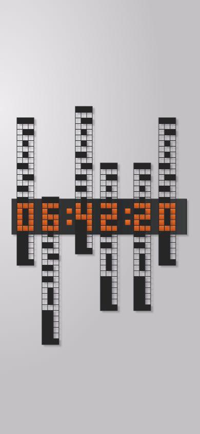

# Time Slider / 滑轨时钟

中文：用上下滑动的镂空网格显示时间。提供分列、整位、原作双轨与字母栅格四种模式，默认显示秒数，进入或刷新时从零滑动到当前时间；提供经典灰墙、荧光绿、荧光黄和纯黑荧光主题，支持跟随系统并记住选择。设置收进菜单，支持仅时钟模式、全屏和 10–3600 倍快进测试。整位版共用 0–9 遮罩；原作版复用作者 STL 遮罩和位置表，左一列、右两列独立滑动，完整显示滑轨；字母版使用相同的连续镂空滑轨，支持 A–Z、数字及 16 种符号；下方输入框可输入六个字符，平滑过渡至新内容。字母模式默认开启每秒一词的轮播，完整覆盖字符集；菜单可暂停，点击输入框可停止并编辑。

English: A pixel mechanical clock with moving perforated grids. Includes column, whole-digit, original dual-rail and 5×5 alphabet modes, seconds by default, a zero-to-current-time opening animation, classic, fluorescent green, fluorescent yellow and OLED green themes with saved preferences and system appearance, a settings menu, clock-only mode, fullscreen, and accelerated testing at 10–3600× speed. Whole-digit masks share a fixed pattern. Dual rails reproduce the author’s mask rows and offsets with full visible bounds. The alphabet mode uses identical continuous perforated column rails for A–Z, digits and 16 symbols. An input below the rails transitions to up to six new characters. The alphabet mode starts a one-second test carousel by default, covering every supported character in all six slots. Pause it in the menu or click the input to stop and edit.



## 在线体验 / Live Demo

- [Cloudflare Demo](https://xiaosang.cc/time-slider-clock/)
- [整位滑轨 / Whole-digit clock](https://xiaosang.cc/time-slider-clock/whole-digit/)
- [原作双轨 / Original dual rails](https://xiaosang.cc/time-slider-clock/hardware/)
- [字母栅格 / Alphabet matrix](https://xiaosang.cc/time-slider-clock/matrix/)
- [GitHub Repo](https://github.com/holynova/time-slider-clock)


## 本地运行 / Run locally

```bash
npm ci
npm run dev
```

打开 / Open `http://localhost:4178/whole-digit/`.

## 检查与发布 / Check and deploy

```bash
npm run check
npm run deploy:check
npm run deploy
```

Cloudflare Workers · `xiaosang.cc/time-slider-clock` · v1.0.7

源码和部署配置均在 `main`；从同一提交在本地手动发布，无 Cloudflare 自动发布工作流。
Source and deployment configuration share `main`; deploy manually from the same commit.

## 参考 / Reference

网格外观参考 [Hans Andersson 的 Time Slider](https://tiltedtwister.com/timeslider.html)。原作双轨版参考其两片遮罩及固定外壳；六位秒钟、网页动画与字母栅格是本项目扩展。原作衍生几何遵循 [CC BY-NC-SA 4.0](https://creativecommons.org/licenses/by-nc-sa/4.0/)。
The lattice appearance references Hans Andersson’s Time Slider; the dual-rail geometry is adapted under CC BY-NC-SA 4.0. Seconds, web motion and the alphabet mechanism are extensions.

由于 xiaosang.cc 已达 Workers 自定义子域名上限，使用已有域名下的独立 Worker 路径路由。
A dedicated Worker route under the existing domain avoids the zone’s custom-domain limit.

[字母滑轨合并与优化方案 / Rail optimization proposal](./references/letter-rail-optimization.md)
